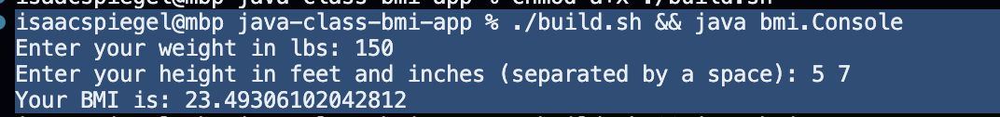
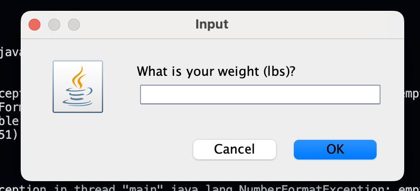
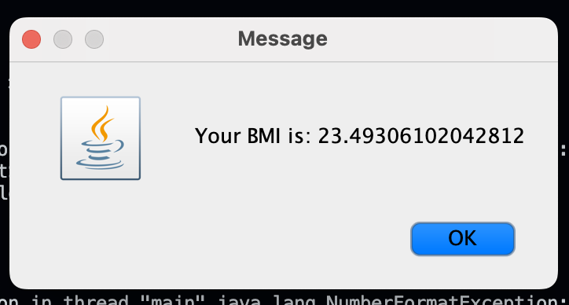

# Java Class BMI App

This is a simple Java class that calculates the Body Mass Index (BMI) of a person. The class has a main method that reads the weight and height of a person from the console and calculates the BMI. The BMI is then printed to the console.

The other class: `Pane` is a simple class that creates a series of dialog boxes to read the weight and height of a person and then displays the BMI in a dialog box.

## Running the App

```bash
jenv local 17 && \
./build.sh && \
java bmi.Pane
```

## In Action

### Console



### Dialog





